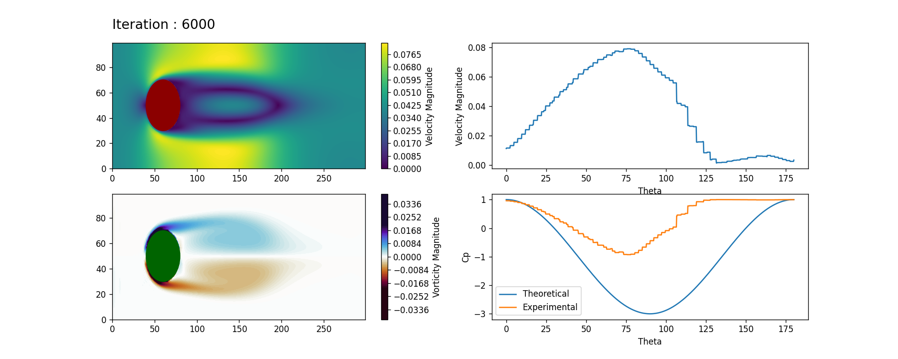

# van-karman-vertex-sheet

Simulation of Flow around a cylinder using lattice boltzman method

**To Create a video simulation using the images generated in image folder using ffmpeg**

`ffmpeg -framerate 30 -i %d.png output.mp4`
